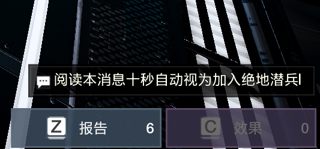

# HellDivers2-Chinese-Input
- 绝地潜兵2中文输入小工具
- 这是一个基于 C# 的小工具程序，用于将中文字符直接发送到指定窗口中（指绝地潜兵2）

# 使用方法
- 1.运行程序(此时右下角会出现一个白色的文本框)，可使用CTRL+T呼出和隐藏。
- ~~2.在游戏中打开对话框然后呼出程序对话框输入你想输入的字符。~~(1.6版本后无需此操作)
- 3.按下回车后会自动发送到游戏的对话框中。

# 注意事项
- 此方法适用于窗口化应用或游戏，但不支持全屏独占游戏，因全屏独占可能阻止窗口消息处理。
- ~~必须要在游戏中呼出对话框后再使用本程序打字。~~

# 程序截图

# 使用效果

- 

## 📋 更新日志

| 版本           | 更新内容                             | 
| ---------------- | -------------------------------------- | 
| v1.0-v1.4           | 修复bug             | 
| v1.5           |       新增自定义拖拽窗口          | 
| **v1.6** | **增加自定义呼出按键** | 
